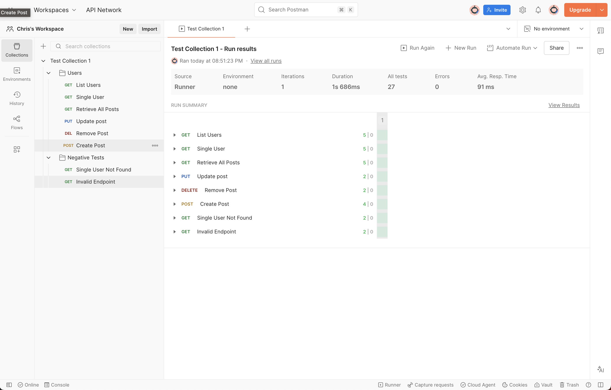

# Public API Test Suite - Postman Collection

This collection demonstrates comprehensive API testing using JSONPlaceholder (fake REST API).

## Features
- Full CRUD operations on users and posts
- Positive and negative test cases (404, invalid endpoints)
- Schema validation, response time checks, header validation
- Over 50 assertions across 10+ requests

## How to Use
1. Import the `.json` collection into Postman
2. Run the Collection Runner to see all tests pass

## Screenshots

Built by Chris DeSantis - QA Automation Engineer